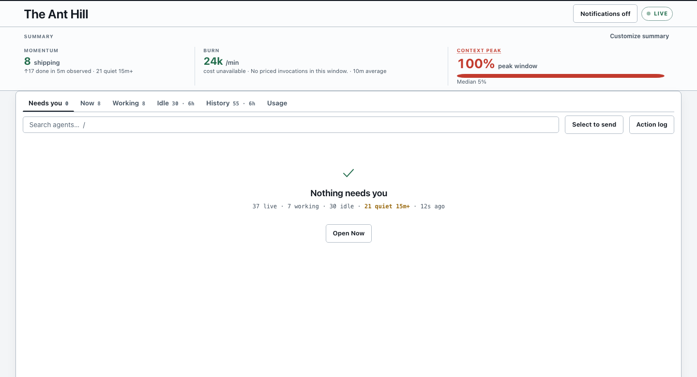
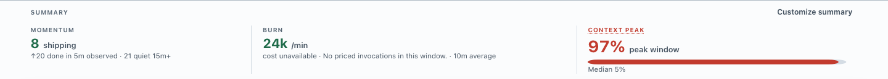
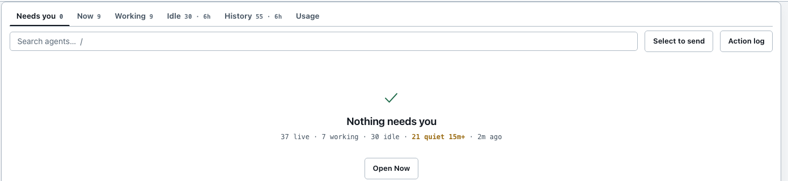
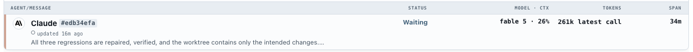
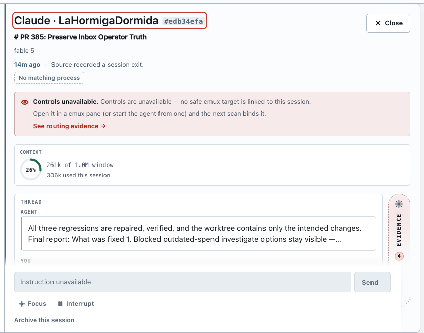
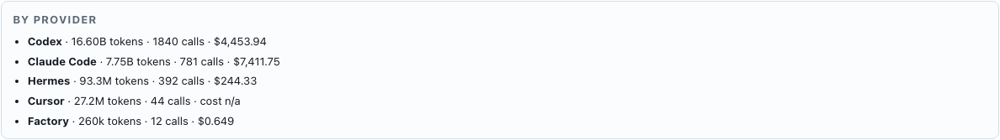

# The Ant Guide

**You have several AI coding assistants running at once. This is the one screen
that tells you which one needs you.**



Open it at **http://127.0.0.1:4701** and leave it open. It updates itself.

**What you are looking at above is the ordinary case, not a demo.** Taken at
23:11 on 2 August from a machine with 28 live sessions, 4 of them working — and
the Needs-you strip still reads **0**, because none of them was waiting on a person.
That is the product's whole claim in one picture: a busy fleet and an empty
to-do list are not a contradiction, and the board says so rather than listing
everything it can find.

Your first run will have fewer rows than this, possibly one or none. `Needs you
0` with nothing under it is the tool working, not the tool failing to find
anything. If it is completely empty, see *The board is empty* at the end.

This guide is about *using* a dashboard that is already running. To install one
on a new machine, see [QUICKSTART.md](./QUICKSTART.md).

> **The one rule worth learning first.** When the Ant Hill does not know
> something, it says so instead of showing a plausible number. A blank is
> usually honest, not broken.

> **And three things that are still open.** The counters that were
> arithmetically correct but mislabelled — a total that counted the same tokens
> twice, a span that called dormant time working time — are now either corrected
> or named for what they measure, so the board's numbers are no longer
> wholesale "rough". These remain:
>
> - **Cost figures do not yet say what falls outside your window.** The server
>   knows; the card does not print it. See *Usage has its own windows* below.
> - **Cost totals were double-counting, and the correction went downward.** The
>   cost source records some sessions as running *snapshots* — each one a fresh
>   total for that session, not a fresh call — so a later snapshot already
>   contains the earlier one and adding them counts the same tokens twice. The
>   board now counts each session's running total **once**, which is why a
>   figure you saw earlier may have gone **down**: the correction removes
>   double-counting, it never adds spend. Both halves are de-duplicated now, so
>   a window and the spend before it add up to the same whole record whichever
>   window you pick.
> - **Archive keeps things for less time than it says.** See *Archive does not
>   keep things as long as it claims* at the end.
>
> Everything else on the board is either measured or blank.

---

## The 60-second version

Four steps. Do these in order and you have used the tool correctly.

### 1. Check the Needs-you strip



**The band only shows you what it has something to say about.** A card with
nothing to report is absent, not empty — so the shape of the band is itself the
signal. Above, four cards: two findings to review, the fullest context window on
the machine, work in flight, and what it is burning.

**When nothing needs you it collapses to a single line** — what is shipping,
what it is burning, and a one-word verdict. No cards, no numbers to read past.
That word is `All clear` only when nothing is being watched either; if any
session has gone quiet it reads **`Watch`** instead, with the count beside it.
Observed live: `4 shipping · 31k tok/min · $4.81 last hour · 6 quiet 15m+ ·
Watch`. Both are answers you can close the tab on — `Watch` means nothing is
asking for you, not that something is wrong.

When cards are showing, **only `Findings` is a to-do list** — it names both what
is wrong and what to do about it. The rest are context, not tasks: how much is
shipping, what it is costing, how full the fullest context window is, and whether
the system itself is healthy.

### 2. The board opens on `Board`



`Board` is the default, and its first block is the shortlist: a pinned
**Needs you** strip holding only the sessions actually waiting on a human,
across every program. When nothing is asking it says so on that line — *No
session is asking for you* — rather than vanishing, so you can tell "I checked"
from "I have not looked". Everything else on the machine is directly underneath
it, grouped by workstream, so the shortlist never costs you sight of the fleet.

### 3. Read the row



Every row is **one AI session**. Left to right:

| Part | What it is |
|---|---|
| Name | Who it is: a declared lane/run name when available, otherwise its authored name or starting folder |
| Message | The last thing it said |
| Status | Often blank, on purpose. It prints only what the tab does not already guarantee — so `Working` never appears, and on `History` the column stays quiet entirely. A word here means something you would not have assumed: `Waiting`, `Alert`, `Blocked`, `Failed`. A session asking for you always says so. Hover for the full state. |
| Model · ctx | Which model, and how full **this session's** context window is right now |
| Tokens | **The latest model call only** — not the session, not the day. See the warning below. |
| Span | First activity to last activity — **including every hour it sat dormant.** Not time spent working. A session showing `3d` may have worked for ten minutes of it. |

A row indented under another with `↳` is a **subagent** — something the row above
it launched.

Names follow one precedence chain: an operator rename wins first; a run
manifest wins next (or the workspace's `ANTHILL_*` declaration when no manifest
binds the session); then come a provider-authored name, the folder where the
session began, its task line, and finally the provider fallback. Workers use
their declared lane id, while a declared orchestrator uses the run id. Manifest
parentage also wins over transcript inference, so a declared lane stays under
the orchestrator that owns its run.

> **The one number that will mislead you.** A row's **Tokens** is that agent's
> *latest model call*. The **session tokens** figure on the grey program bar above
> it is the *cumulative* total for every agent in that program, ended ones
> included — on a real board, about a third of it came from sessions that are
> already finished.
>
> They are not the same unit and **the program is not the sum of its rows.** The
> gap runs to three or four orders of magnitude — a program bar in the hundreds
> of millions above a row in the hundreds of thousands — and the multiplier moves
> daily, so treat any specific ratio you have been told as out of date. What does
> not move is the rule: if you want to know what a session has used in total,
> open its drawer and read *used this session*; do not add up the column.
>
> One exception, in `History` only: a handful of sessions archived before this
> distinction existed carry no token unit at all. Their Tokens cell is **blank**
> — measured on the live board, 18 rows out of 534 finished ones, reporting
> neither a turn nor a session figure. A blank there is the honest answer rather
> than a fault: the record predates the distinction, so no number can be labelled
> correctly. Read its drawer if you need the total.

### 4. Click it, deal with it, press `Escape`



The drawer holds everything about that one session: what it last said, whether
its process is still alive, and the four buttons that act on it.

| Button | Does |
|---|---|
| **Focus** | Jumps you to that session's terminal window |
| **Send** | Types an instruction into it |
| **Interrupt** | Stops what it is doing |
| **Archive** | Removes a finished session from the board — but see the retention warning at the end before relying on it to *keep* anything |

The first three need cmux (see the glossary). Without it they grey out with a
reason, and the board still watches everything perfectly well.

**Send and Interrupt need more than Focus does**, and this is the one place the
buttons deliberately disagree. Focus only moves your eyes — worst case you look
at the wrong terminal and immediately see that you have. Send and Interrupt put
characters into a live tty, and typing into the wrong one is not recoverable by
noticing.

So the two are gated differently:

| The row's link to a terminal | Focus | Send / Interrupt |
|---|---|---|
| cmux names the session on that pane through its live terminal scan or hook-session store, and its process is alive | on | **accepted** |
| matched only by its folder | on | **greyed out** |
| the session's process is gone | on | **greyed out** |
| ambiguous, or no pane found | off | greyed out |

All of them look the same in the window: if a write cannot be honoured, the
button is not offered. That used to be untrue of one row — a dead process kept a
lit Send and refused only once you pressed it — which was safe but dishonest,
and the button and the server are now decided by the same rule rather than by
two places agreeing. Hover any greyed control and it tells you which of these
applies and what would bring it back.

*How much of this has been seen rather than reasoned:* the first and last rows
are ordinary and visible on any busy board. The middle two are not — a healthy
fleet spends almost no time in either, and the live board has held **none** of
them all day across 556 sessions.

Both have now been produced deliberately and watched, on a probe agent in an
isolated instance pointed at a real cmux pane. A folder-matched row came back
with **Focus enabled, Send disabled**, carrying exactly the reason quoted below;
a row whose process was known dead came back the same way. So these rows are
observed behaviour rather than inference — though produced on demand rather than
met in the wild, which is a weaker thing than seeing a real fleet do it and is
worth saying.

### The promise behind that table

Every Send that table withholds is the cockpit declining to do something on your
behalf that it cannot prove is safe.
Read the rows as guarantees, because that is what they are:

**It will not type into a terminal it cannot name.** Not "probably the right
one" — cmux has to say *this session is on this pane*. A pane merely sitting in
the right folder is a guess, and two panes in one project, one `cd`ing away as
another `cd`s in, is enough to move that guess onto the wrong terminal while the
row still reads perfectly healthy. That happened here, to a real Send. So a
folder match may move your view and never your keystrokes.

**It will not type into a session that has already exited.** A finished or
crashed agent leaves its pane behind, and that pane usually belongs to your
shell by the time you get there. An instruction addressed to a dead agent does
not vanish — it lands in whatever is sitting on that terminal now. So once the
board has checked and found the process gone, a Send is refused rather than
delivered, and says the pane may now belong to someone else. The row stays
readable; only the writing stops.

**It will not act on stale evidence.** Which terminal an agent is on is a fact
with a short shelf life. If the board's picture is too old to trust, a write is
refused rather than sent on the strength of where the agent *used to* be.

None of these are degraded states. A board that says `All clear` and still greys
out Send on one row is working exactly as designed: everything it can verify, it
did, and the one thing it could not verify it declined to guess. **The board is
never the reason you cannot reach an agent — it is the reason you do not reach
the wrong one.** Focus stays on throughout precisely so you always have a way in:
go and look, and type there yourself.

**To get Send and Interrupt back:** start the agent *inside* a cmux pane and
leave it there, and keep the session running. Identification works first from
cmux's hook-session record when its stable surface still exists; otherwise it
falls back to finding the session's transcript held open by a process on that
pane, or the session ID in the command that started it. Hook records also report
`running`, `idle`, `needsInput`, or `unknown`, and their PID is accepted as live
only when its recorded process start still matches. An agent started in an
ordinary terminal, or in a pane that has since moved elsewhere, has none of
these, so it can be watched but not typed into. No setting turns any of this
off; the controls come back on their own within a few seconds of the board being
able to prove the answer again.

**That is the whole loop:** read the Needs-you strip → click the row → deal with it →
`Escape`.

---

## Reference

<details>
<summary><b>The three tabs</b></summary>

| Tab | Shows |
|---|---|
| **Board** | Every live session, in one scroll. The tab it opens on. |
| **History** | Finished sessions. Collapsed by default — there are usually a lot. |
| **Usage** | Token and cost charts over time, rather than a list. |

Board reads top to bottom in one pass:

1. **Needs you** — a pinned strip of every session asking for a human, across
   every program, each row carrying the program it came from. It is never
   collapsible, and when nothing is asking it says so rather than disappearing.
   Those rows appear *only* here; their program group below leaves a note saying
   how many of its sessions are in the strip.
2. **Program groups** — your workstreams, in the order the server ranks them.
3. Inside each group, **Active → Waiting → Unverified** dividers. An empty
   section is not drawn. The dividers are labels, not buttons — nothing about
   them can be clicked into a state that hides a session.

There used to be five tabs: `Needs you`, `Now`, `Waiting`, `History`, `Usage`.
The first three were three lenses on one live fleet, and the split cost you the
thing the board is for — reaching a waiting session meant leaving the tab
showing the working ones. Attention still comes first; it is a strip you can
read while you look at everything else, rather than a tab you have to select.

A swarm's children start **collapsed**, behind the `swarm N` chip on the parent
row — click it to open, and the board remembers. A collapsed child that starts
asking for you still appears in the Needs-you strip, and the parent's chip turns
ember: nothing can hide inside a folded swarm. The board never opens one for
you.

## The four states a session can be in

One word per session, and only one. This is the vocabulary everything else on
the board is written in.

| State | What it means |
|---|---|
| **Working** | Actively producing — source activity in the last few minutes. |
| **Waiting** | Open but not producing: it finished a turn and is waiting on you, or it has gone quiet while its process is still live. |
| **Unverified** | Silent for a while, and no matching process was found. Ant Hill cannot tell whether it is still alive — so it says that, instead of guessing. |
| **Finished** | Ended with evidence: the source recorded a session exit, you archived it, or its process is confirmed gone. |

**Unverified is the one worth understanding.** It is not a broken session and it
is not a finished one — it is a gap in what the board can see. A session whose
terminal was closed, whose machine slept, or that simply went quiet with nothing
left to probe all land here. They sit under the **Unverified** divider at the
bottom of each program group, and that section **ignores the lookback**: it is a
disclosure of what cannot be accounted for, not a list of recent things, and most
of them are older than six hours by definition.

Sessions used to be filed as finished in this situation. Nothing had observed
them ending — the board simply could not see them and said "ended" anyway, which
is how a running session became impossible to find.

A finished session also says *why* it finished: a recorded session exit, your own
archive, a process confirmed gone, or "no longer watched" for one that drifted
out of the scan window. Those are four different facts and used to be one word.

`Board` and `History` also apply a *lookback* window (6 hours by default) that
you can widen from the filter bar. The Unverified group is exempt, as above.

**Usage has its own windows, and the widest one you can ask for is narrower
than what has been kept.** Two ceilings, and neither is the end of the data:

| What you can ask for | Limit |
|---|---|
| The preset buttons | `1h`, `24h`, `7d`, **`30d`** |
| **Custom**, typed in **hours** | 90 days (`2160`) — also the most the server will answer |

The cost database keeps going after that. So `30d` is not "everything", it is
the widest *button*; `90d` is not "everything" either, it is the widest
*question*. On a machine that has been running for months, both are a recent
slice of the record, and **nothing on the card says so** — a window always looks
complete, which is what makes this a limit you meet by being surprised rather
than by reading.

The gap only widens. On day 30 the `30d` view was the whole record; every day
since, it has hidden more, silently, while reading exactly the same.

Treat any figure here as *spend inside the window you chose*, never as total
spend. "Our 30-day cost" and "what this has cost us" are different questions,
and only one of them has a button.

**The same figure has a second boundary, and it is the one worth building a
habit around.** The window narrows it in *time*; this narrows it in *which
tools*. The board reads Claude Code, Codex, Cursor and OMP. Anything else you
run that costs money — a scheduled job, a CLI added since, a provider someone
set up on a Friday — spends real money and appears on the board nowhere: no row,
no session, and **no gap where one should be**.

**So read the provider list.** On the **Usage** tab, under the cost, is a
breakdown by provider. That list comes from your billing source rather than from
the board's collectors, so it names everything you are billed for whether or not
the board can see it. **Any name there you cannot find as a row is a tool the
board is not watching.** It takes five seconds and it is the only check that
finds this.



That is the list on the machine these screenshots came from, at `30d`. **Factory**
gained a collector on 2026-08-04 and now has rows like any other provider;
**Hermes** still does not, and its spend appears there and nowhere else on the
board.

Health will not find it for you, and this is the part to understand rather than
worry about. `5 of 5 collectors healthy` is counting the collectors the board
*has*, and they are genuinely fine. A tool it was never taught to watch has no
collector, so there is nothing to report as unhealthy — the green line is
accurate and simply does not cover the question. On the machine these
screenshots came from, one billed provider sits outside it, and it is a daily
cron job.

That is not a fault to report; it is the shape of the instrument. **The board
tells you about what it watches. The provider list tells you what you pay for.
Comparing them is your job, and it is a five-second one.**

### Finding out what *your* board cannot see

The five collectors are the same everywhere. What differs from machine to
machine is what else you are billed for, so this is a check you run on your own
board rather than a list anyone can hand you.

1. Open **Usage** and set the range to **`30d`**, or Custom with `2160` for
   ninety days. **Do this first.** The breakdown only lists providers with spend
   *inside the window*, so a job that runs weekly is invisible at `24h` — on the
   machine these screenshots came from, one provider appears at `30d` and not at
   `24h`.
2. Read the **by provider** list under the cost.
3. Compare it against the four the board collects: **Claude Code, Codex, Cursor,
   OMP**.
4. Anything in the list that is not one of those four is **billed and
   unwatched** — real money, no row, no session, and nothing on the board
   indicating it exists.

**And this check has its own boundary, which is the same habit applied once
more.** The list comes from your cost source, so it finds tools your cost source
prices and the board does not collect. A tool that *neither* knows about is
invisible to both — and if you have no cost source installed, there is no list
and this check cannot run at all.

So the last backstop is not on this board and never was: **it is your actual
bill.** Compare that against the Usage total once, when you first set this up.
If they agree, these two lists are the whole picture and you can stop checking.
If they do not, the gap is the size of what nobody here can see.

**The guarantee being built here: this product will tell you when a view cannot
show you everything.** Not "show you less and look complete" — say so, and say
how much is outside. The measurement already exists: ask the server for a window
and it answers with that window's spend *and* what sits before it, back to the
earliest record it holds. On a machine that has been running for months, most of
the record is outside the default view. A window that hides the majority of the
record while looking whole is the same defect as a cost of `$0` that means
*unknown*, and it gets the same treatment.

**What that buys you is one number that means something.** Add a window to the
spend before it and you get the whole recorded history — and the same whole
whichever window you ask through. Measured on this machine at 23:21 on
2026-08-02: **about $33,677 of total measured spend across the entire record**,
identical to the cent from seven different windows between one day and 399, on
both of the figures the payload reports.

**It is still a reading, not a fact.** It grows as the fleet works and it counts
only what a cost source priced. Quote it with its date or do not quote it — that
rule applies to every number in this product whose inputs are still moving, and
it is why the figure above carries a timestamp rather than standing alone.

What makes it worth quoting at all is not any single measurement. That total has
now survived four separate corrections — de-duplicating cumulative session
snapshots, disclosing what sits outside the window, a row cap, and a range clamp
— and seven windows agree on it afterwards. A number that survives having its
inputs rebuilt underneath it and lands in the same place is a different kind of
claim from a number someone read once.

*Where this stands today:* the server computes and returns it — the number above
is a live reading, not a plan. The Usage card does not print it yet, so for now
you get the honest answer by asking, not by looking. When the card carries it,
this paragraph loses its last sentence and nothing else changes.

</details>

<details>
<summary><b>The summary cards</b></summary>

On a clear board these collapse into a single line and only the shipping,
finished-this-hour, burn and `All clear` figures survive. They expand into cards
when something needs you — and **each cell renders only if it has something to
report.** A band that always renders cannot signal by rendering, so a card with
no data is absent rather than showing you an empty one. Health also stays quiet
when the Needs-you strip has already told you the same thing.

Each one counts a **different set of agents** over a **different stretch of time**,
and none of them says so on its face. That is the single most useful thing to know
about this band, so it is stated for each:

| Card | What it tells you | Counts what, over what |
|---|---|---|
| **Findings** | Everything open that a human should know about — collector faults, policy drift, and sessions waiting on you. | Findings, not agents: one finding can implicate many sessions. This card and the Needs-you strip below it are **deliberately different numbers**, and they say so in different words. The card counts all findings; the strip counts only sessions waiting on a person. The card reading `1` while the strip is clear means *something is open, but no session is waiting on you* — which is why the board says exactly that instead of "Nothing needs you". |
| **Momentum** | How many are shipping, and how many have gone quiet. | "Shipping" is live sessions whose transcript was written **in the last 3 minutes** — it means recently active, not making progress. "Quiet" is **15+ minutes** since last activity. |
| **Burn** | A token rate, and spend if cost data is available. | Summed across every session that reported, **including ended ones**. It names its own averaging window when it knows it (`5m average`) and says nothing when it does not — so a rate with no window beside it is one you cannot size. It also names how many live sessions report no tokens at all, because they contribute zero to it forever. Spend comes from a separate tool over its own hour: **do not divide one by the other**, they share no denominator. |
| **Context peak** | How full the fullest session's context window is, plus the median. | The highest and middle `ctx%` across **live sessions only** (working or waiting) that report a window. Finished and unverified sessions are excluded. A high peak means one session is near its limit — the median tells you whether it is one or all of them. |
| **Health** | One verdict for the whole system. | Not a count. See the health section below. |

Hide, show, and reorder these with **Customize summary**.

</details>

<details>
<summary><b>What is finished but not pushed</b></summary>

Agents commit far faster than anyone pushes, so finished work piles up locally
and the only way to see it was to run `git` by hand. This answers it:

```bash
curl -s http://127.0.0.1:4701/api/publish
```

**It is an endpoint today, not a card on the board.** Nothing in the dashboard
shows it yet, so you have to ask for it.

It reports two different things, deliberately kept apart. The **trunk** says how
far `main` has run ahead of `origin/main` — one number, stated once. Each
**branch** then reports only the commits that are *not* already in the trunk.
Counting every branch against the remote instead would report the same backlog a
dozen times over, once per branch that happens to descend from it.

A branch is judged finished by its **patch**, not its ancestry: if its changes
are already in `main` — squash-merged, rebased, cherry-picked — it goes quiet
even though the graph still calls it unmerged. Branches nobody has touched for a
fortnight are counted but not listed, so old work cannot nag.

> **It never pushes.** The only git it runs is `remote`, `rev-parse`,
> `rev-list`, `for-each-ref` and `cherry` — all read-only. There is no POST, no
> push, and no one-click anything, by design: publishing is a decision you make,
> not one the dashboard makes for you. A test pins that list, so it cannot widen
> later without someone noticing.

When it cannot tell — no remote, no trunk, or a trunk that tracks nothing — it
says so instead of reporting a comfortable zero. Remote URLs are redacted before
display, because an `https` remote can carry a token.

</details>

<details>
<summary><b>Keyboard</b></summary>

| Key | Does |
|---|---|
| `/` | Jump to the search box |
| `↑` / `↓` | Move between rows |
| `←` / `→` | Move between tabs |
| `Home` / `End` | Jump to the first / last row |
| `Enter` | Open the drawer for the highlighted row |
| `Escape` | Close the drawer |
| `Tab` | Move between controls — the whole tab strip counts as one stop |

Row arrows stop at the top and bottom rather than wrapping, so you cannot
accidentally teleport to the other end of a long board. Tab arrows do wrap —
there are only six, and going round is what you want.

`Tab` treating the tab strip as a single stop is deliberate. Search used to be
the eleventh stop of fourteen, with the six view tabs eating six of the ten
ahead of it, so reaching the board's main filter meant tabbing past everything.
That is what `/` is for.

</details>

<details>
<summary><b>Glossary</b></summary>

Terms marked *(on screen)* are things you can point at. The rest only come up in
conversation, so you do not go hunting for a button that does not exist.

**Agent** *(on screen)*
: One AI coding session — one `claude` or `codex` command in one terminal, or one
Cursor agent. Every row is one agent. Not a person, not a project: a single
running conversation.

**Program** *(on screen)*
: A group of agents, usually meaning one project folder. The grey bars splitting
the board into sections are programs. Click one to collapse it. Without
configured project names, sessions group by working directory.

**Drawer** *(on screen)*
: The panel that slides in when you click a row. Everything about one agent: last
message, process state, which terminal it is attached to, the action buttons, and
the **Evidence** and **Transcript** sections for raw detail.

**Swarm** *(on screen)*
: When one agent launches others, they form a tree. The board shows this with
indentation and `↳`. Agents can carry roles like *orchestrator*, *frontend*,
*backend*, *verifier*, or *tester*.

**Swarm control** *(on screen, as `Select to send`)*
: Acting on several agents at once. Click **Select to send**, tick the agents you
want, and a bar appears letting you send one instruction to all of them (a
**broadcast**). Agents that cannot be safely reached are not selectable, on
purpose, so on a quiet board you may find nothing to tick.

**Collector**
: The part that reads each tool's log files — one per provider **the board was
taught about**. When a collector cannot read its files, that provider's data goes
stale and Health reports it. A tool the board was never taught about has no
collector at all, so it cannot go stale and cannot be reported — see *read the
provider list*, above.

**Snapshot**
: One complete picture of every agent, rebuilt every few seconds and pushed to
your browser. "The board is stale" means the snapshot stopped updating.

**cmux**
: A separate terminal manager. With it, the Ant Hill knows which terminal window
each session lives in, which is what makes **Focus** and **Send** possible.
Without it the dashboard still watches everything, and the write controls stay
off — see *The promise behind that table*.

**Name a session** *(what the phrase costs you)*
: Not "found a likely pane" — *cmux names this session on this pane*, evidenced
by the session's transcript file being held open there or its ID appearing in the
command that started it. A pane merely sitting in the right folder is a guess,
and guesses are allowed to move the view but never to type. The button table in
step 4 above says which controls survive which case.

**Lane** *(conversation only)*
: One workstream, worked by one agent, on its own git branch. Several run at once
and each lands into `main`. See [DEPLOY.md](./DEPLOY.md).

**Wave** *(conversation only)*
: A batch of work done across several lanes at roughly the same time, then merged
together. "Wave 6" is a round of changes, not a place.

</details>

---

## When something looks wrong

<details>
<summary><b>Health is not "All clear"</b></summary>

The card says which of four things it is, and **if it claims something is wrong
it also names the next step.** Only a clear board is allowed to say nothing.

| Verdict | Meaning | What it tells you to do |
|---|---|---|
| **All clear** | Nothing is wrong. | Nothing. This is the resting state. |
| **Blocked** | The control plane is unreachable. **Focus and Send do not work.** | `Start cmux, then Refresh` — waiting will not fix it. Usually cmux is not running or not set up. |
| **Stale** | The numbers may no longer be true — the live feed or last refresh failed. | `Refresh to re-pull the evidence`. The button on the card is **Retry snapshot**. |
| **Advisory** | Something needs doing, but the board is fully usable. | Whatever the card says. Often tidying, and it will tell you which panes. |

A clear board can still offer a **tidy-up**: leftover cmux panes whose sessions
have all ended. That is an offer, not a fault — it never turns the board red,
and the **Show N panes** button lists exactly which ones, by pane title and how
long each has been quiet.

**A button only appears when pressing it could change the answer.** If the
control plane is down you get **Verify repair** (re-probe cmux after starting
it); if the feed or last refresh failed you get **Retry snapshot**. When the
card already names an action no re-pull can perform — closing a pane, say —
there is no button, because the only one available would be the one that cannot
help.

**By far the most common is a cmux-related `Blocked` on a machine where cmux was
never set up.** That is expected, not a fault — it is the first guarantee in
*The promise behind that table* above, doing its job. If you only want to
watch, ignore it forever. If you want Focus and Send, install cmux and run
`bun run setup:cmux` once.

`Health: Offline` is different: your browser has lost the server entirely. See
"Nothing loads."

</details>

<details>
<summary><b>Send is greyed out but Focus still works</b></summary>

**The reason is always on the control — hover a greyed button, or read the
message a refused Send returns.** All of them are the cockpit declining to guess
on your behalf, not a fault to repair.

**"matched by its working directory, not attested by cmux."** The row is linked
to a terminal by folder, not by name. The board would rather refuse a Send than
deliver it to a terminal it only *probably* identified — a pane that `cd`s away
and another that `cd`s in is enough to move the match to the wrong session while
the row still reads healthy.
→ *Fix:* start agents inside cmux panes and leave them there. Identification
needs the session's transcript file open on that pane, or its ID in the command
that launched it.

**The session's process is gone.** The pane outlives the agent, and by the time
you get there it usually belongs to your shell again. An instruction to a dead
agent is not discarded — it lands in whatever is on that terminal now. The row
shows a `died` chip and Send is greyed out to match it; hovering says the process
was checked and is gone.
→ *Fix:* none needed. The session is over. Read it, then `Archive` it.

**The board's picture is too old to act on.** Which terminal an agent is on goes
stale quickly, so a write is refused rather than sent to where it *used* to be.
→ *Fix:* `Refresh`. This one resolves itself.

**Use Focus in every case.** It is left on for exactly this reason: go and look
at the pane and type there directly. That is the recovery path, not a
workaround. Nothing here needs configuring or restarting — each control
re-enables itself within a few seconds of the board being able to prove the
answer again.

</details>

<details>
<summary><b>An agent says "No matching process"</b></summary>

That is the **process liveness** chip in the drawer. It answers what status alone
cannot: *is this session's process actually still alive?* A crashed agent and a
cleanly finished one both just stop, and otherwise look identical.

| Chip | Meaning |
|---|---|
| **Process live** (green) | Still running. |
| **Exited cleanly** (grey) | Finished properly. Done. |
| **Died** (red) | The process is gone and nothing ended cleanly. **This is the one worth looking at.** |
| **No matching process** (grey, dashed) | The session is still on the board, but the scan has matched no process to it, so its liveness is unproven. It may match later or never — the board does not promise either. |
| **No process evidence** (grey, dashed) | The session ended and no evidence was captured, so whether it finished or crashed can no longer be recovered. |

No chip at all means the session predates process checking. Absence of evidence
is never displayed as evidence of death, and most finished sessions on a busy
board read **No process evidence**. That is normal.

**No matching process** is normal too, and it is not a fault in the session: on a
live board it tracks whether the board could route to the session's terminal at
all. Every live agent wearing it in two measured snapshots was **Observed only**
or **Quarantined**; every live agent reading **Process live** was **Linked**. If
you want the process answer for one of them, fix the routing — the drawer's
routing evidence says what the scan saw.

</details>

<details>
<summary><b>Nothing loads at all</b></summary>

The page not loading means the server is not running — different from
`Degraded`, which means the server *is* running and reporting a problem.

Restart it:

```bash
launchctl kickstart -k gui/$UID/ai.imaginethat.anthill
```

Check it came back — this should print `200`:

```bash
curl -s -o /dev/null -w "%{http_code}\n" http://127.0.0.1:4701/
```

If that fails, see what is actually up:

```bash
bash ~/Developer/the-mountain-main/scripts/anthill-ps.sh
```

> **Do not start anything on port 4701 by hand.** That port belongs to the
> background service and a hand-started copy will collide with it. To try a
> change safely, run `bash scripts/anthill-preview.sh`, which picks a free
> throwaway port and refuses to touch 4701.
>
> **4701** is the permanent background one, and it is also what `bun start`
> binds — so `bun start` reuses the running service rather than starting a
> second copy. For a throwaway instance use `anthill-preview.sh`, which picks a
> free port in the 4710–4719 range.

</details>

<details>
<summary><b>The board is empty</b></summary>

If it says **"Watching. No sessions running yet,"** the server is healthy and
genuinely sees nothing. Underneath it is the proof: a count of healthy
collectors and a ticking `checked Ns ago`. A board that had failed to load could
not produce either, which is what tells you this is an answer rather than a
blank screen. Either nothing has run recently, or everything has aged out — only
about the last day and a half is scanned by default.

If instead it says **"No sessions found — and not every collector can see,"**
that is a different state and not an empty fleet: at least one collector is
degraded, so the board is incomplete rather than empty, and sessions may be
running that it cannot show you.

Start a session (`claude` or `codex` in any project folder) and a row should
appear within about five seconds, no refresh needed.

Also check you have not filtered yourself into an empty room: clear the **search
box**, and remember `Board` and `History` apply their own lookback window
(the Unverified section does not).

</details>

<details>
<summary><b>A grey shimmering placeholder sits there</b></summary>

That is the loading skeleton, shown while the first data is fetched. It should be
replaced within a second or two. If it persists, the page is waiting on a server
that is not answering — restart it.

</details>

<details>
<summary><b>Archive does not keep things as long as it claims</b></summary>

**Known, being fixed. If you archive something because you want to keep it,
read this first.**

The board advertises **30 days** of archive retention. What you actually get is
30 days *from the session's last activity*, not from the moment you archived it
— the clock was already running before you pressed the button, and nothing
records when you pressed it.

So the retention you receive is 30 days **minus however stale the session
already was**:

| You archive a session last active… | You keep it for about |
|---|---|
| today | 30 days |
| 20 days ago | 10 days |
| 31+ days ago | **it is pruned on the next save — possibly before you look again** |

The last row is the one that costs you something. `Archive` returns success and
the record can already be gone. Meanwhile the number the board reports is a
fixed constant, so it will keep saying 30 regardless of what was delivered.

**Until this is fixed:** if a finished session matters, copy what you need out
of its drawer rather than trusting `Archive` to hold it. Archiving a *recently
active* session behaves as advertised; it is old sessions that evaporate.

**The repair has landed, and it is forward-only.** It works by recording the
moment you archive, so it can only help records stamped after it shipped.
Anything archived before that has no stamp and keeps running on the old clock.

Measured on this machine at 17:25 on 2026-08-02: **360 of 578 archived records
now carry an archive time, and 218 do not.** The board reports both, rather than
averaging them into one reassuring figure — a record it cannot measure is
counted as *unmeasurable*, never as zero.

**What has not been demonstrated yet is the outcome.** The oldest stamped record
is less than a day old, because the stamping only began when the fix shipped. So
the mechanism is verifiable today and the promise is not: nothing has yet been
held for thirty days *and observed to still be there*. That takes thirty days
and cannot be hurried. Until then, the honest reading is that the clock now
starts in the right place, not that the full term has been proven.

</details>

<details>
<summary><b>Costs are blank, or say "cost unavailable"</b></summary>

Dollar figures come from a separate tool (OpenBurnBar). Without it, the Ant Hill
shows cost as unavailable rather than inventing a `$0`. Token counts still work.

</details>

<details>
<summary><b>A session shows "not reported" for context or tokens</b></summary>

Not every provider reports the same numbers. Claude transcripts report tokens
used but not always the size of the context window, and without both, a truthful
"% full" cannot be calculated — so the dashboard shows the raw token count
instead of guessing a percentage.

</details>

---

## Where to go next

| Document | Covers |
|---|---|
| [QUICKSTART.md](./QUICKSTART.md) | Installing it on a fresh machine |
| [DEPLOY.md](./DEPLOY.md) | Ports, deploying, previewing changes safely |
| [README.md](./README.md) | Technical overview and the data-truth rules |
| [TRIAGE-WORKFLOW.md](./TRIAGE-WORKFLOW.md) | The investigation and triage flow |
| [ARCHITECTURE.md](./ARCHITECTURE.md) | How the pieces fit together |
